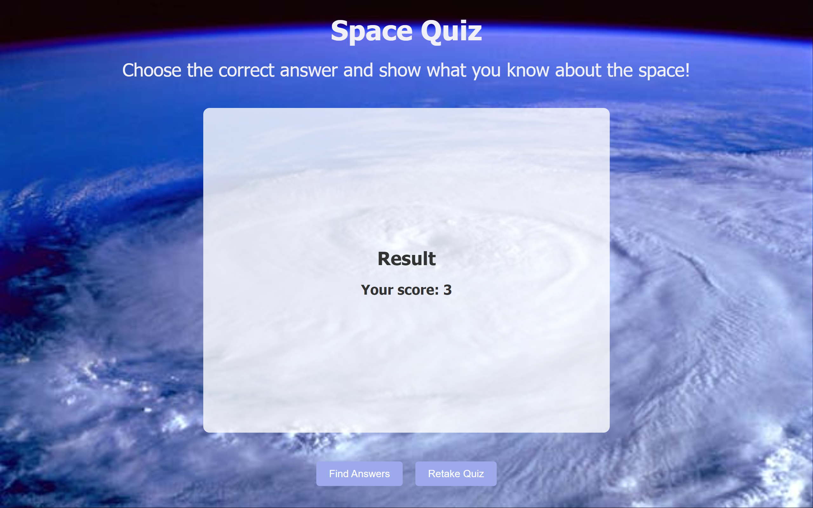

<h1>Space Quiz</h1>

Are you ready for an out-of-this-world adventure? Come and join us on the SpaceQuiz website where you can explore the wonders of the universe, test your knowledge, and become a space expert! Let's play and learn together!

<h2>UX</h2>

The main idea for the site was to inspire users, usually kids, to learn about the space answering the quiz and having fun.

<h3>User Stories</h2>

User Goals:

1. Friendly Design: the website should have a colorful, welcoming design with space-themed visuals that attract and engage kids.
2. Simplicity: information and navigation should be kept simple and intuitive to ensure young users can easily find their way around.
3. Clear Instructions: all instructions and quiz questions should be written in clear, age-appropriate language to ensure understanding.
4. Interactive Learning: the quiz should be interactive to encourage learning and keep kids motivated.
5. Fun and Educational: the content should be both entertaining and informative, teaching kids about space in a way that feels like play.

Functional Requirements:
1. Quiz page: multiple-choice questions about space with clear, concise questions and answer options.
2. Result page: summary of the user's performance and option to retake the quiz or go back to the answers page.
3. Answer page: clear and concise answer for each question.
4. Design elements: space-themed background to create an immersive experience.
5. Bottons: Large and easy-to-read fonts.

Non-Functional Requirements:
1. Acessibility: the website should be accessible on various devices, including tablets and smartphones.
2. Performance: the website should load quickly to maintain the attention of young users.
3. Security: the website should be safe and secure, ensuring the privacy of its young users.

<h2>Design</h2>

The website contains different shades of blue:

[RGB color (255, 255, 255, 0.8); ](https://rgb.to/255,255,255)

[RGB color (240, 240, 246)](https://rgb.to/240,240,246)

[HEX color #4e81ca](https://rgb.to/hex/4e81ca)

[Hex color #16327a](https://rgb.to/hex/16327a)

[Hex color #9ca9eb](https://rgb.to/hex/9ca9eb)

<h2>Features</h2>

1. Favicon

The favicon was generated using the image favicon generator:

- Favicon Generator: (https://favicon.io/favicon-converter/)
- Image Source: (https://www.pexels.com/photo/illustration-of-space-shuttle-3697825/

2. Quiz Page

This section allows the user to easily navigate and answer the quiz.

The navigation use a space background, to make an immersive experience.

2. Score page

The home page shows a summary of the user's performance.

3. Answer page

Everytime the user finishes the quiz there is an option to check the correct answers.

<h2>Manual Testing</h2>

The manual testing was done on the deployed project at Github.

- Links are working
- Interactions are working
- The forms will not be submitted if the fields have not been filled correctly
- The pages are responsive

<h2>Validator Testing</h2>

HTML validation: no errors were found  on the official W3C validator

CSS validation: no errors were found  on the official (Jigsaw) validator

Acessibility: the site is friendly, easy to read and acessible- confirmed by running it through lighthouse in dev tools

<h2>Bugs</h2>

1. Solved bugs

In the documentation folder, the images name was written with spaces, capital letters and special characters.

2. Unsolved bugs

No aditional bugs were detected.

<h2>Deployment</h2>

The site was deployed to GitHub pages. The steps to deploy are as follows:

In the GitHub repository, navigate to the Settings tab;

From the source section drop-down menu, select the Main Branch, then click "Save".

The page will be automatically refreshed with a detailed ribbon display to indicate the successful deployment.

<h2>Credits</h2>
<h3> Content</h3>

- Information about the climate action plan 2024-2029- Climate 
Neutral Dublin 2030 was taken from [Neutral Dublin 2030](https://www.dublincity.ie/residential/environment/dublin-city-councils-climate-change-action-plan/dublin-city-council-climate-action-plan-2024-2029)

- Information about the mandatory EU recycling targets [EU recycling targets](https://www.epa.ie/news-releases/news-releases-2023/recycling-rates-slow-as-ireland-off-track-to-meet-key-eu-targets.php)

- The social media links was taken from CI Love Running Project

- The icons in the footer was taken from [Fontawesome](https://fontawesome.com/)

<h3> Media</h3>
The images were taken from Pexels and Istockphoto websites.

[Home up page img1](https://www.istockphoto.com/photo/aerial-top-view-green-forest-with-earth-green-planet-in-your-hands-save-earth-gm1406761842-458200738)

[Home up page img2](https://www.pexels.com/photo/person-holding-clear-plastic-bottle-3480494/)

[Home up page img3](https://media.istockphoto.com/id/1386672256/photo/reduce-co2-emission-concept-in-the-hand-for-environmental-global-warming-sustainable.jpg?b=1&s=612x612&w=0&k=20&c=SuTDvxnEdSIhsWK9w73n3fLLjFBvg1VvfDQCdNYidKw=)

[Home up page img4](https://images.pexels.com/photos/12492301/pexels-photo-12492301.jpeg?auto=compress&cs=tinysrgb&w=600)

[About page img1](https://www.pexels.com/photo/woman-in-blue-denim-jacket-holding-a-plastic-bottle-and-black-plastic-bag-5029852/)

<h2>Technologies Used</h2>

- HTML
- CSS
- Java Script

